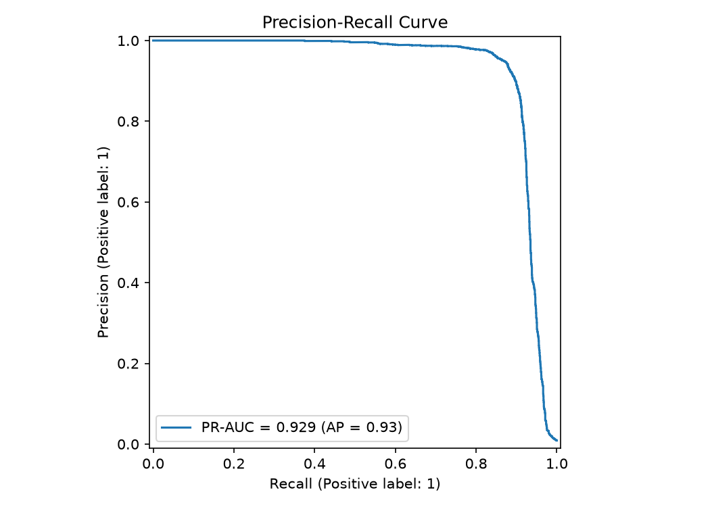
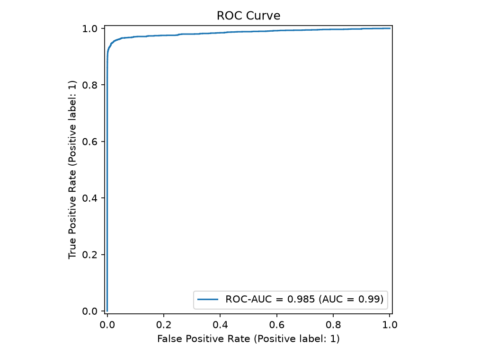
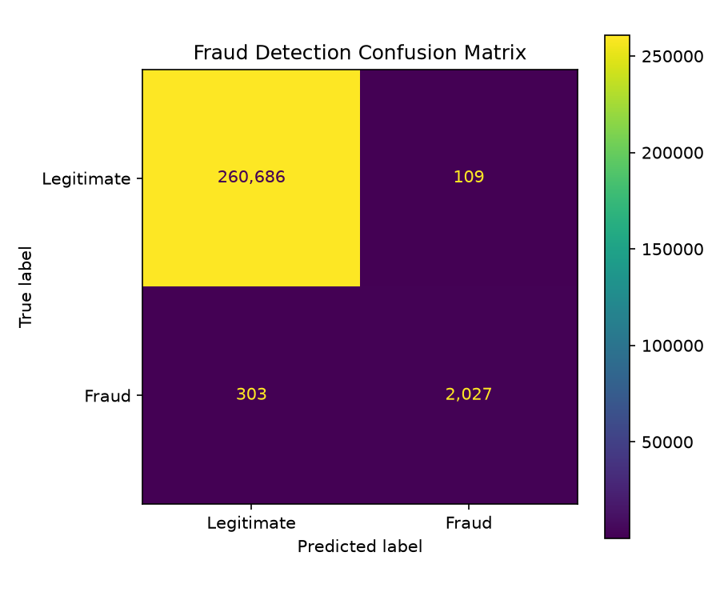

# Fraud Detection ML API

[](https://github.com/ardaatikk/fraud-detection-ml-api/actions/workflows/ci.yml)
[](https://www.python.org/)
[](https://fastapi.tiangolo.com/)
[](https://www.docker.com/)
[](https://github.com/ardaatikk/fraud-detection-ml-api/tree/main/tests)
[](https://github.com/ardaatikk/fraud-detection-ml-api/blob/main/LICENSE)

An end-to-end machine learning system for transaction fraud detection, covering data validation, leakage-aware feature engineering, chronological evaluation, model comparison, threshold optimization, real-time inference, FastAPI serving, Docker containerization, automated testing, and continuous integration.

The project is built around a highly imbalanced transaction dataset containing more than **1.75 million transactions** and demonstrates how an ML model can be taken beyond experimentation into a reproducible inference service.

---

## Overview

Fraud detection is an imbalanced classification problem in which fraudulent transactions represent only a small fraction of all observations.

Instead of relying only on individual transaction values, this project builds historical behavioral features describing:

- customer transaction frequency,
- customer spending behavior,
- transaction amount relative to historical customer spending,
- terminal activity,
- historical terminal fraud counts,
- historical terminal fraud rates,
- transaction time characteristics.

All historical features are constructed using only information available **before the transaction being evaluated**, reducing temporal leakage.

The final system includes:

- automated dataset acquisition,
- raw data validation,
- historical feature engineering,
- chronological train/validation/test splitting,
- feature-set experiments,
- model comparison,
- validation-based threshold selection,
- held-out test evaluation,
- inference-time feature reconstruction,
- FastAPI prediction endpoints,
- Docker deployment,
- unit tests,
- GitHub Actions CI.

---

## Architecture

```text
Raw Transactions
       │
       ▼
Data Validation
       │
       ▼
Leakage-Aware Feature Engineering
       │
       ▼
Chronological Train / Validation / Test Split
       │
       ▼
Feature-Set Experiments
       │
       ▼
Candidate Model Comparison
       │
       ▼
Validation Threshold Optimization
       │
       ▼
Held-Out Test Evaluation
       │
       ▼
Model + Threshold Artifacts
       │
       ▼
Inference Feature Builder
       │
       ▼
FastAPI
       │
       ▼
Docker Container
```

The training and inference layers use the same feature contract consisting of **19 model features**.

---

## Dataset

The project uses the simulated transaction dataset from the **Fraud Detection Handbook**.

The complete dataset used by the pipeline contains:

| Property | Value |
|---|---:|
| Transactions | 1,754,155 |
| Time period | April 2018 – September 2018 |
| Target | `TX_FRAUD` |
| Problem type | Binary classification |
| Positive class | Fraud |

Large raw and processed datasets are intentionally excluded from Git.

If the raw dataset is not available locally, the training pipeline automatically downloads and reconstructs it from the source daily transaction files.

---

## Feature Engineering

The model uses **19 features** divided into four groups.

### Transaction Features

- `TX_AMOUNT`

### Temporal Features

- `TX_HOUR`
- `TX_DAY_OF_WEEK`

### Customer Behavioral Features

- `CUSTOMER_TX_COUNT_1D`
- `CUSTOMER_TX_COUNT_7D`
- `CUSTOMER_TX_COUNT_30D`
- `CUSTOMER_AVG_AMOUNT_1D`
- `CUSTOMER_AVG_AMOUNT_7D`
- `CUSTOMER_AVG_AMOUNT_30D`
- `AMOUNT_TO_CUSTOMER_AVG_1D`
- `AMOUNT_TO_CUSTOMER_AVG_7D`
- `AMOUNT_TO_CUSTOMER_AVG_30D`

### Terminal Behavioral Features

- `TERMINAL_TX_COUNT_1D`
- `TERMINAL_TX_COUNT_7D`
- `TERMINAL_TX_COUNT_30D`
- `TERMINAL_FRAUD_COUNT_7D`
- `TERMINAL_FRAUD_COUNT_30D`
- `TERMINAL_FRAUD_RATE_7D`
- `TERMINAL_FRAUD_RATE_30D`

Historical rolling features exclude the current transaction.

This same behavior is reproduced by the inference feature builder used by the API.

---

## Chronological Evaluation

Transactions are split chronologically instead of randomly.

This better represents a deployment scenario in which a model learns from historical transactions and is evaluated on future transactions.

| Split | Rows | Fraud Cases | Fraud Rate |
|---|---:|---:|---:|
| Train | 1,227,908 | 9,996 | 0.8141% |
| Validation | 263,122 | 2,355 | 0.8950% |
| Test | 263,125 | 2,330 | 0.8855% |

The held-out test set is used only after model and threshold selection.

---

## Feature-Set Experiments

A Logistic Regression baseline was evaluated with progressively richer feature sets.

| Feature Set | Features | PR-AUC | ROC-AUC |
|---|---:|---:|---:|
| Amount only | 1 | 0.2468 | 0.6440 |
| Amount + temporal | 3 | 0.2462 | 0.6445 |
| Customer behavior | 12 | 0.2897 | 0.6692 |
| Terminal behavior | 10 | 0.7721 | 0.9508 |
| All engineered features | 19 | **0.8230** | **0.9790** |

The experiment shows that historical behavioral information contributes substantially more predictive signal than transaction amount alone.

---

## Model Comparison

Two candidate models were compared on the validation set.

| Model | PR-AUC | ROC-AUC |
|---|---:|---:|
| Logistic Regression | 0.8230 | 0.9790 |
| HistGradientBoosting | **0.9265** | **0.9866** |

The final selected model is:

**HistGradientBoostingClassifier**

PR-AUC is treated as a primary ranking metric because the target is highly imbalanced.

---

## Decision Threshold

The classification threshold is selected on the validation set rather than assuming the default `0.5`.

The threshold maximizing validation F1 was:

```text
0.5275168786
```

At this threshold:

```text
Validation F1 = 0.903126
```

The selected threshold is stored independently from the trained model and reused during inference.

---

## Final Test Results

After model and threshold selection, the system was evaluated once on the held-out chronological test set.

| Metric | Score |
|---|---:|
| PR-AUC | **0.9287** |
| ROC-AUC | **0.9852** |
| Precision | **0.9490** |
| Recall | **0.8700** |
| F1 | **0.9077** |

### Confusion Matrix

| | Predicted Legitimate | Predicted Fraud |
|---|---:|---:|
| Actual Legitimate | 260,686 | 109 |
| Actual Fraud | 303 | 2,027 |

The model correctly detected **2,027 of 2,330 fraudulent transactions** while producing **109 false positives** on 263,125 test transactions.

---

## Evaluation Visualizations

### Precision-Recall Curve



### ROC Curve



### Confusion Matrix



---

## Training and Inference Consistency

Historical features are required both during model training and during API inference.

To prevent training-serving skew, the project contains a dedicated inference feature builder that reconstructs the same **19-feature model contract** from historical transactions.

Training and inference feature calculations were verified against the same transactions, including:

- rolling customer transaction counts,
- rolling customer averages,
- amount-to-average ratios,
- terminal transaction counts,
- historical fraud counts,
- historical fraud rates.

The inference layer also supports customers and terminals without previous history by using zero-history defaults.

---

## Project Structure

```text
fraud-detection-ml-api/
├── .github/
│   └── workflows/
│       └── ci.yml
├── artifacts/
│   ├── figures/
│   └── models/
├── data/
│   ├── processed/
│   └── raw/
├── notebooks/
│   └── 01_eda.ipynb
├── src/
│   ├── api/
│   ├── config/
│   ├── data/
│   ├── features/
│   ├── inference/
│   ├── models/
│   └── pipeline/
├── tests/
│   └── unit/
├── Dockerfile
├── requirements.txt
├── requirements-dev.txt
└── LICENSE
```

---

## Installation

Clone the repository:

```bash
git clone https://github.com/ardaatikk/fraud-detection-ml-api.git
cd fraud-detection-ml-api
```

Create and activate a virtual environment:

```bash
python -m venv .venv
source .venv/bin/activate
```

Install runtime dependencies:

```bash
pip install -r requirements.txt
```

For development and testing:

```bash
pip install -r requirements-dev.txt
```

---

## Training Pipeline

Run the complete training pipeline with:

```bash
python -m src.pipeline.training_pipeline
```

The pipeline executes eight stages:

```text
1. Dataset acquisition
2. Raw dataset validation
3. Feature engineering
4. Chronological splitting
5. Baseline feature experiments
6. Candidate model comparison
7. Decision-threshold selection
8. Final held-out test evaluation
```

Generated model artifacts are stored under:

```text
artifacts/models/
```

Evaluation figures are stored under:

```text
artifacts/figures/
```

---

## Running the API

The API is implemented with FastAPI and served with Uvicorn.

Start it locally:

```bash
uvicorn src.api.main:app --host 0.0.0.0 --port 8000
```

Interactive API documentation is then available at:

```text
http://localhost:8000/docs
```

---

## API Endpoints

### Health Check

```http
GET /health
```

Example response:

```json
{
  "status": "ok"
}
```

### Model Information

```http
GET /model-info
```

Example response:

```json
{
  "model_name": "hist_gradient_boosting",
  "threshold": 0.5275168786353864,
  "feature_count": 19
}
```

### Fraud Prediction

```http
POST /predict
```

Example request:

```json
{
  "transaction_id": 1499976,
  "customer_id": 1085,
  "terminal_id": 5504,
  "tx_amount": 304.10,
  "tx_datetime": "2018-09-04T12:13:34"
}
```

Example response:

```json
{
  "transaction_id": 1499976,
  "fraud_probability": 0.9998460491721085,
  "is_fraud": true,
  "threshold": 0.5275168786353864,
  "model_name": "hist_gradient_boosting"
}
```

The API accepts raw transaction information and reconstructs the historical behavioral features required by the model.

---

## Docker

Build the image:

```bash
docker build -t fraud-detection-api .
```

The inference service requires access to historical transaction data for behavioral feature construction.

Run the container with the local raw-data directory mounted as read-only:

```bash
docker run \
  --name fraud-detection-api \
  -p 8000:8000 \
  -v "$(pwd)/data/raw:/app/data/raw:ro" \
  fraud-detection-api
```

Then verify the service:

```bash
curl http://localhost:8000/health
```

---

## Testing

The project includes unit tests covering:

- raw data validation,
- feature engineering,
- temporal leakage prevention,
- chronological splitting,
- model configuration,
- feature contracts,
- threshold selection,
- inference feature generation,
- API behavior,
- request validation.

Run the complete test suite:

```bash
pytest -v
```

Current test suite:

```text
45 passed
```

---

## Continuous Integration

GitHub Actions automatically runs CI for pushes and pull requests targeting `main`.

The workflow contains two stages:

```text
Unit Tests
    │
    ▼
Docker Build
    │
    ▼
Container Startup
    │
    ▼
/health Smoke Test
```

The Docker job runs only after the unit-test job succeeds.

This verifies both the Python codebase and the deployable container in a clean CI environment.

---

## Reproducibility

The project separates generated data from source code.

Large raw and processed Parquet files are excluded from version control, while model artifacts, evaluation metrics, and figures are preserved.

The training pipeline can reconstruct the required dataset and regenerate the complete modeling workflow from source.

---

## Limitations

This project uses simulated transaction data and should not be interpreted as a production fraud detection system for real financial transactions.

The current inference history store reads historical transactions from a local Parquet dataset. A production deployment would typically replace this with a low-latency feature store, database, streaming system, or another persistent backend.

The selected threshold optimizes validation F1. Real fraud systems would generally choose operating thresholds according to business costs, investigation capacity, false-positive tolerance, and fraud-loss objectives.

---

## Future Improvements

Potential extensions include:

- probability calibration,
- cost-sensitive threshold optimization,
- additional fraud-specific behavioral features,
- feature-store integration,
- persistent or streaming transaction history,
- model monitoring and drift detection,
- batch prediction support,
- automated retraining,
- API authentication and rate limiting,
- containerized integration tests with synthetic historical data,
- production deployment configuration.

---

## License

This project is licensed under the **MIT License**.

See the `LICENSE` file for details.

---

## Author

**Arda Atik**

Artificial Intelligence Engineer

GitHub: `ardaatikk`